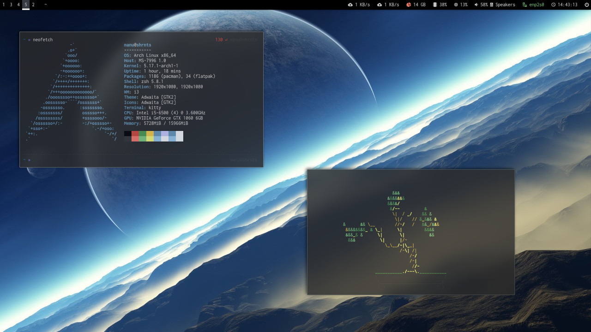

# dotfiles

- OS: Arch (btw)
- WM: i3
- Bar: Polybar
- Shell: ZSH
- Terminal: Kitty
- File manager: Ranger
- Launcher: Rofi
- Notifications: Dunst
- Editor: Vim
- Browser: Google Chrome

## Install

See https://www.chezmoi.io/

## Dependencies

Install https://github.com/Jguer/yay

    yay -S $(cat dependencies.txt | tr '\n' ' ') 
